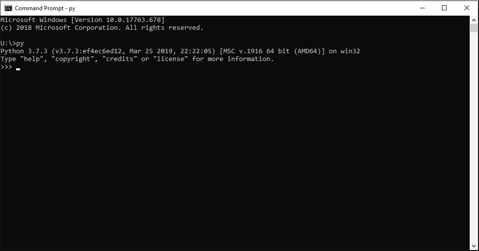
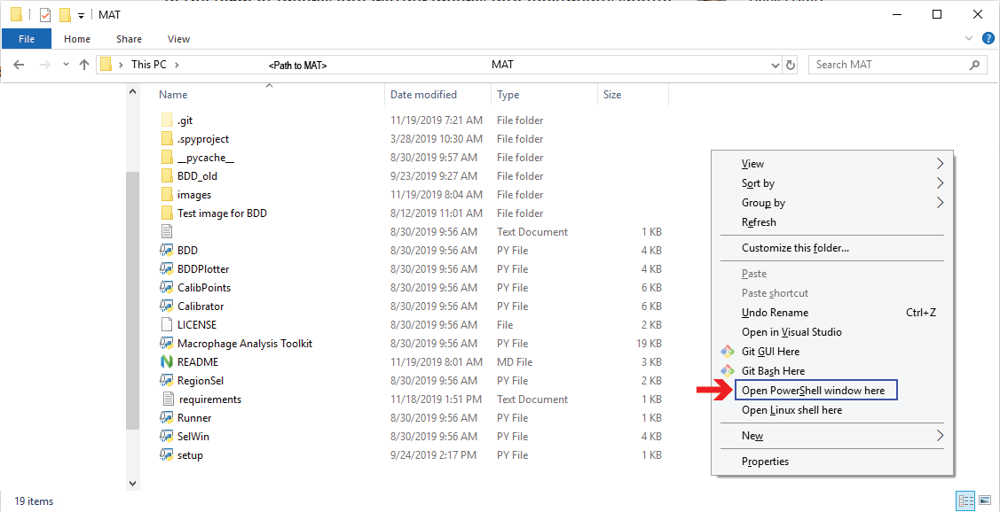
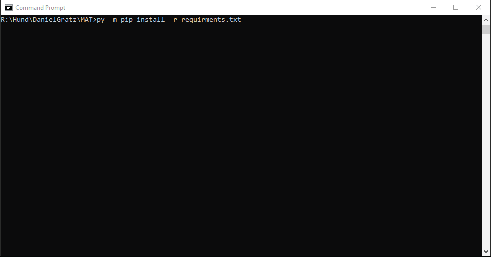

# Macrophage Anlaysis Toolkit (MAT)

## Setup
### Windows
1. Python 3.7 will need to be installed prior to seting up MAT. Python 3.7 can be 
    downloaded from python.org, or installed via your package manager in linux. 
    The x86-64 executable installer is reccommended, as the default install
    configuration will set python to open .py files by double clicking. If it 
    is installed correctly opening a cmd or powershell window  and typing py
    should start a python prompt.
    
2. From a terminal window navigate to the folder where MAT has been downloaded. 
    This can also be achieved by opening the MAT folder in File Explorer,
    Right Clicking + Shift, and selecting 'Open Powershell here' or 'Open 
    Command Prompt here'.
    
3.  From the prompt window, to install the dependancies run the command 
    `py -m pip install -r requirments.txt`. Alternatively install these 
    dependancies: matplotlib, scipy, scikit-image, scikit-learn, xlrd, xlsxwriter,
    numpy, PyQt5, pillow.
    
4. To run MAT either open the command prompt/powershell as directed in (3) and
   run `py 'Macrophage Analysis Toolkit.py'` or double-click on 
   *Macrophage Analysis Toolkit.py* from the file explorer.

### Mac/Linux
1. Python 3 will need to be installed prior to seting up MAT. Python 3 can be 
    installed via your package manager in linux. If it is installed correctly
    opening a terminal and typing python (in some distributions such as Ubuntu
    the command is python3) should start a python prompt.
2. From a terminal window navigate to the folder where MAT has been downloaded. 
    From there run the setup.py to ensure all dependancies are installed. Run
    with the command `pip install -r requirments.txt`. Alternatively install these 
    dependancies: matplotlib, scipy, scikit-image, scikit-learn, xlrd, xlsxwriter,
    numpy, PyQt5, pillow.
3. To run MAT either use the command `python 'Macrophage Analysis Toolkit.py'` or
    double-click on *Macrophage Analysis Toolkit.py* from the file explorer.
